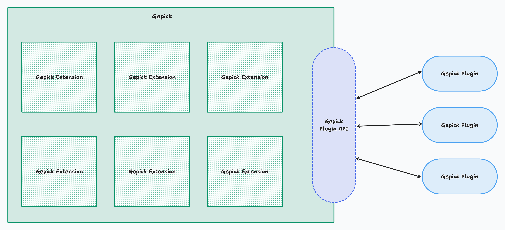

# gpk



针对[Theia](https://github.com/eclipse-theia/theia)中基于`references`等tsconfig配置去进行的相关extension包的构建和源码维护的探索。
（ps：探究的背景是为了我正在开发的gepick上升一个纬度，朝着成为类似于theia的二次开发的平台方向演进）

## 操作

在项目根目录下分别执行以下操作并观察现象

- `yarn build`：观察build之后的产物和产物之间的关系，到`apps/browser/src/index.ts`观察导入的`import { main } from "@gpk/p2/lib/browser/frontend-application";`，点击你会发现跳转到的地方是源代码而不是构建产物js的.d.ts文件里头了。同时你会发现产物是按照依赖关系构建的。
- `yarn start`
- `yarn clean`：你会发现相关一连串有关的库的产物会被清理。

## ts references作用

tsconfig当中可以配置一个字段references，有啥用举个例子来说明：
在monorepo项目当中，你写了多个包，需要构建成js的dist才能用。此时你在主项目引入这些包，如果没有这个references配置，你点击相关包导出变量，你去到的地方就是该包dist的.d.ts的声明文件，此时你想我希望点击的时候跳转到ts源码可以吗？可以的，配置这个字段，将path指向你的包的tsconfig所在路径就能实现这一点，因此如果你使用了多个包，你就的写多个指向。
当然这个字段的本来作用其实是依赖顺序构建，类似于NX提供的依赖构建顺序问题的解决方案，你可以尝试下这个项目的`yarn build`，你会发现相关联的包都会被构建起来，nx也可以实现同样的功能。因此，对于仅包含 TypeScript 项目并且主要关注增量构建和依赖关系管理的情况，你可以只使用 tsc -b 来处理这些问题，而不需要使用 Nx。tsc -b 可以有效地处理 TypeScript 项目中的依赖关系，并提供增量构建功能。在这部分功能上，Nx和tsc -b的效果都是一样的，都可以进行依赖产物构建，保证主项目正确执行。
在Theia当中，你可以在整个项目很多地方看到这种用法。

## 导入package包和使用package包

在Theia项目中，你经常能看到这种类似的用法`import { CommandContribution, MenuContribution } from '@theia/core/lib/common'`。当你点击对应路径的时候，跳转到的地方是`@theia/core/src/common/index.ts`。这样的效果其实就是通过[ts references作用](#ts-references作用)实现的。在Theia中，具体是这么做的：

- 第一步：注册包 - 在使用`@theia/core`的包`package.json`注册为该包依赖`"@theia/core": "1.53.0"`。
- 第二步：使用包 - 在具体的地方使用`@theia/core`，导入的lib是`@theia/core`构建后的产物：`import { CommandContribution, MenuContribution } from '@theia/core/lib/common'`。
- 第三步：支持点击构建产物路径跳转回源代码：在具体使用的包的`tsconfig.json`中对`references`配置`@theia/core`的包路径，类似于`{ "path": "../core"}`。

在本项目`gpk`中，我们为了更好的路径引用，对于包内部的路径也配置成了绝对路径的方式，比如`core`内部的文件相互引用的时候，是这么用的`import { createServiceIdentifier } from '@gpk/core/common/instantiation';`。具体的绝对路径的引用是通过`tsconfig.base.json`配置的`paths`：`"@gpk/core/*": ["./packages/core/src/*"]`。
因此，如果你在使用`core`包的地方，比如`console`，在里头你会看到两种类似的路径：

- 引用其他包，如`@gpk/core`：`import { IFrontendApplicationContribution } from '@gpk/core/lib/browser/frontend-application/frontend-application-contribution-point';`，注意这里的前缀是`@gpk/core/lib`，这就是`Theia`当中你经常能看到的路径引用方式。
- 引用本包文件：`import { ConsoleContribution, _IConsoleContribution } from '@gpk/console/browser/console-contribution';`，注意这里的前缀是`@gpk/console`。
通过上面引用本包文件的引入方式，你就以避免使用多个相对路径引入本地宝文件，看起来十分直观。但是这里会出现一个问题：构建tsc是不会帮你转换这个绝对路径的，那么最终在构建的js文件如果还是使用`import { ConsoleContribution, _IConsoleContribution } from '@gpk/console/browser/console-contribution';`没有进行相对路径转换，由于压根没有`'@gpk/console/browser/console-contribution'`这个路径的js文件就会导致执行出错。为了解决这一点，我们引入`tsc-alias`这个包来解决这个问题，在`tsc`构建后使用`tsc-alias`将绝对路径转化成相对路径。

## tsc -b + vite 二次构建

为啥使用tsc -b还需要vite进行二次构建呢？当设置package.json中的"type": "module"时，import必须带上文件后缀名，否则node执行会报错。但是，这个不是我们想要的结果，因为我们想要的是在不带后缀名的情况下也能正常导入。我们希望`import { browser } from "@gpk/p2/lib/browser/frontend-application.js"`改成直接使用的是`import { browser } from "@gpk/p2/lib/browser/frontend-application"`。为了解决上面的问题，我们先让tsc build构建相关项目，然后再使用vite二次构建dist内容，最后就可以运行dist内容了。相关讨论：<https://www.reddit.com/r/typescript/comments/1b87o96/esm_on_nodejs_file_extension_mandatory/>。在Theia当中，你会发现创建一个新的IDE项目的时候，Theia会给你搞一堆webpack config，我猜实际上也是为了解决这个问题。

## extension机制

Theia整个架构的核心是围绕inversify开展的。在Theia当中将一个个npm包作为extension的外壳，实际上每个extension的核心是ContainerModule，对于一个extension包根据不同的运行环境可以有多个ContainerModule，他们是Theia加载一个extension的入口。每个extension包可能提供以下部分：

- contribution扩展点
- 完全由内部实现的提供给外部使用的service服务
- 由外部提供的contribution + 内部实现的功能组合而成的service服务

这里我实现了一个console extension，它实现了IFrontendApplicationContribution这个contribution扩展点，IFrontendApplicationContribution是由core extension提供的，在这个示例就是由console extension来实现。
最终的console extension在`apps/browser/src/index.ts`可以看到其实就是container.load暴露的console ContainerModule就OK了。你可以尝试在项目根目录尝试运行`yarn build + yarn start`来查看加载一个`console extension`到主应用的效果。

## contribution机制

Theia的contribution机制技术上实际就是一个extension包提供给外部一些interface 接口，让其他extension包帮忙实现对应的contribution，然后在extension的ContainerModule中绑定到由提供contribution扩展点的extension包提供的contribution service id上。
而提供contribution扩展点的extension包内部怎么获取contribution呢？在Theia当中，你会发现eclipse团队会实现一个contribution provider的玩意，这个玩意装着一组外部实现的contribution，theia里头就是通过contribution provider拿的。这个探索项目并没有按照Theia官方实现那样也实现contribution provider，因为我看了下确实没必要，实现contribution provider的原因我猜他们想解决的就是同一个id多服务实现注入的问题，按照目前最新版本的inversify早就实现了这个功能就是@multiInject这个装饰器，估计当时老版本没有这个东西，所以他么自己实现了类似功能。contribution provider的实现也很简单，代码实现可以自行查看：<https://github.com/eclipse-theia/theia/blob/master/packages/core/src/common/contribution-provider.ts>

## JSON-RPC


## plugin机制


在Theia中支持了运行时动态加载的plugin。用户可以在插件市场点击下载自己希望使用的插件，等待插件下载完毕之后就能够使用该插件的功能了。动态加载plugin的关键技术点就是利用了require()或者是import()，它允许你运行时加载某一个模块。

### 动态加载plugin设计

#### 后端部分

- contribution initialize阶段
  - backend application initialze初始化的时候，调动PluginDeployerContribution初始化，并启动pluginDeployer。这一个环节做的事情就是“解析插件”和“部署插件”。
  - 对于插件部署这件事，实际上就是读取插件的相关元信息，以及类型。一个已部署的插件是这么做的，就是定义一个变量并设置到deployedPlugins中而已：`const deployed: DeployedPlugin = { metadata, type }; deployedPlugins.set(id, deployed);`，这些逻辑都放在`HostedPluginDeployerHandler`类中。
- contribution onStart阶段
  - backend application start启动的时候，调动`HeadlessHostedPluginSupport`启动，并调用所继承的父类`AbstractHostedPluginSupport`的`load`方法。这一个环节做的事情就是“同步插件”、“加载插件”、“启动插件”。
  - 对于同步插件`syncPlugins`这件事，实际上内部会尝试启动plugin host子进程（不过debug发现这一端没有fork子进程）。关键的逻辑是`const deployedPlugins = await this.server.getDeployedPlugins({ pluginIds: newPluginIds });`，这个`getDeployedPlugins`方法的主要作用是获取一组已部署的插件，并对这些插件进行本地化处理。整体来说，对于`syncPlugins`来说主要功能是同步插件的状态，确保已部署的插件被正确加载，未部署的插件被卸载，并且在此过程中记录相关的测量数据。

#### 前端部分

- contribution start阶段
  - MyBrowserHostedPluginSupport start调用启动了HostedPluginSupport onStart方法启动插件功能，并调用所继承的父类`AbstractHostedPluginSupport`的`load`方法。这一个环节做的事情就是“同步插件”、“加载插件”、“启动插件”。接下来跟backend端完全一样。
  - 对于同步插件`syncPlugins`这件事，内部会fork出plugin host子进程（这里启动了一个plugin host子进程后端）。
    - 对于fork出子进程，执行入口是`packages/plugin-ext/src/hosted/node/plugin-host.ts`。同样也是创建一个ioc container，load pluginHostModule加载plugin host模块。在`plugin-host`内容里头会获取`PluginHostRPC`，在获取的时候触发继承`AbstractPluginHostRPC`类的`initialize`方法（因为它用了inversify的postConstruct装饰器）。
  - 对于启动插件`startPlugins`这件事，实际上是通过plugin manager这个部分来实现的。而在前端其实拿到的plugin manager是一个rpc代理对象，它可以调用实际上位于`packages/plugin-ext/src/plugin/plugin-manager.ts`这个模块中的`PluginManagerExtImpl`的相关方法。相关方法的接口定义是位于`packages/plugin-ext/src/common/plugin-api-rpc.ts`的`AbstractPluginManagerExt`

    ```typescript
      export interface AbstractPluginManagerExt<P extends Record<string, any>> {
        /** initialize the manager, should be called only once */
        $init(params: P): Promise<void>;

        /** load and activate plugins */
        $start(params: PluginManagerStartParams): Promise<void>;

        /** deactivate the plugin */
        $stop(pluginId: string): Promise<void>;

        /** deactivate all plugins */
        $stop(): Promise<void>;

        $updateStoragePath(path: string | undefined): Promise<void>;

        $activateByEvent(event: string): Promise<void>;

        $activatePlugin(id: string): Promise<void>;

    }
    ```

    而实际上在`startPlugins`有段关键逻辑是`this.handlePluginStarted(manager, plugin);`，其实际上调用的是位于`packages/plugin-ext/src/hosted/browser/hosted-plugin.ts`的`HostedPluginSupport`类的`activateByWorkspaceContains`方法。在`activateByWorkspaceContains`方法中关键的逻辑是

    ```typescript
      const activatePlugin = () => {
            return manager.$activateByEvent(`onPlugin:${plugin.metadata.model.id}`)
    };
    ```

    接着其实`manager.$activateByEvent`内部其实是寻找event对应的所有activation，而activation的定义其实就是调用了`manager.$activatePlugin`方法。
    我们进去看`manager.$activatePlugin`方法的定义：

    ```typescript
     async $activatePlugin(id: string): Promise<void> {
        const plugin = this.registry.get(id);
        if (plugin && this.configStorage) {
            await this.loadPlugin(plugin, this.configStorage);
        }
    }
    ```

    继续深挖`this.loadPlugin`方法，会找到很关键的一段逻辑:

    ```typescript
      let pluginMain = this.host.loadPlugin(plugin);
      pluginMain = pluginMain || {};
      await this.startPlugin(plugin, configStorage, pluginMain);
    ```

    在这里头`this.host`就是我们之前提到的位于`packages/plugin-ext/src/hosted/node/plugin-host-rpc.ts`的`AbstractPluginHostRPC`的`createPluginHost`方法创建出来的host对象。我们看看`loadPlugin`方法

    ```typescript
    loadPlugin(plugin: Plugin): any {
        removeFromCache(mod => mod.id.startsWith(plugin.pluginFolder));
        if (plugin.pluginPath) {
              return dynamicRequire(plugin.pluginPath);
        }
    },
    ```

    这里我们发现关键的部分就是`dynamicRequire(plugin.pluginPath)`，这个就是整个动态加载plugin的核心地方。它会将一个plugin模块导入，结果就是上面的`pluginMain`，这个对象实际上就是对应用户plugin模块向外导出的`activate`和`deactivate`方法的模块对象。
    激活插件的逻辑如下

    ```typescript
    if (typeof pluginMain[plugin.lifecycle.startMethod] === 'function') {
            await this.localization.initializeLocalizedMessages(plugin, this.envExt.language);
            const pluginExport = await pluginMain[plugin.lifecycle.startMethod].apply(getGlobal(), [pluginContext]);
            this.activatedPlugins.set(plugin.model.id, new ActivatedPlugin(pluginContext, pluginExport, stopFn));
    }
    ```

    这里的`plugin.lifecycle.startMethod`其实就是`activate`。通过这种方式，我们将用户开发的Plugin和Theia连接起来了，相关pluginContext上下文会在这个地方传递给用户Plugin。
    简而言之，在`startPlugins`中一次性将manager的$init，$start，$activateByEvent，$activatePlugin方法一次性调用了。

#### 插件市场设计

- 前端提供一个插件市场，让用户能够浏览不同的插件，选择自己希望的插件下载。
- 用户点击插件下载后，拉取对应的插件包，将其部署到本地，以提供使用。
- 使用动态加载机制将插件包主模块加载到应用当中。
- 执行起插件包主模块，调用插件的激活方法activate激活该插件。
