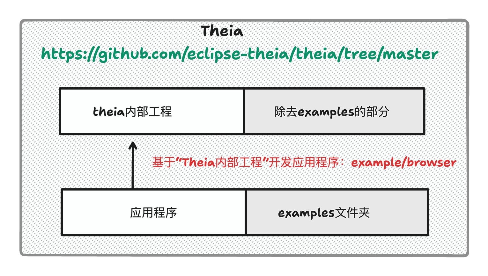
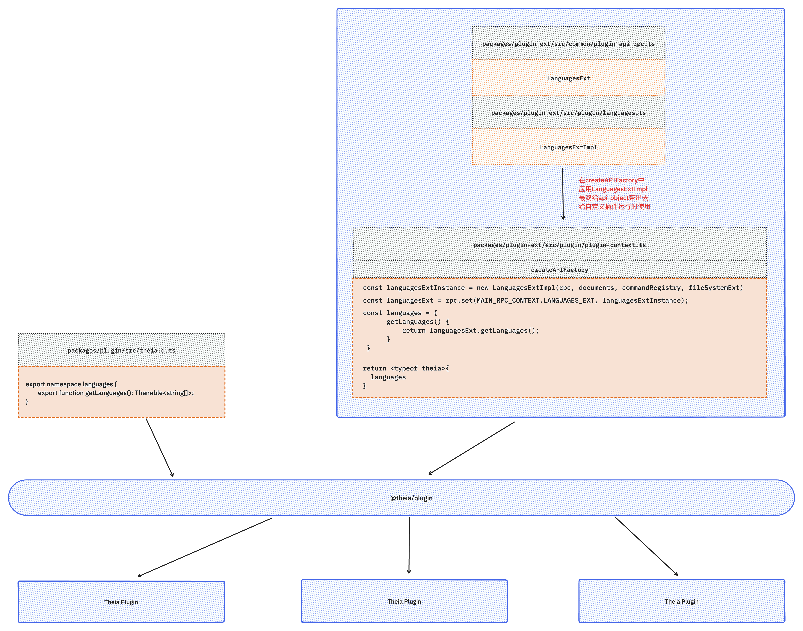
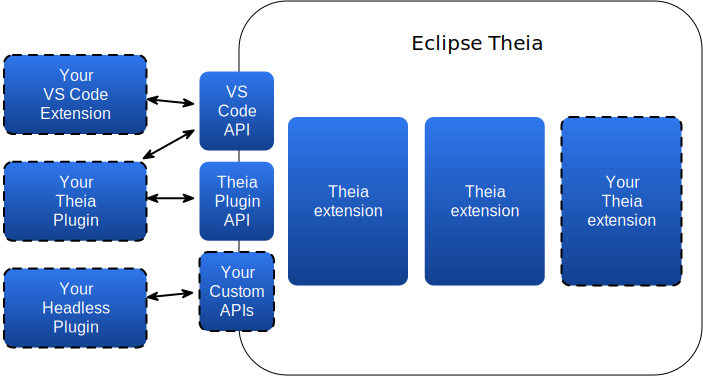
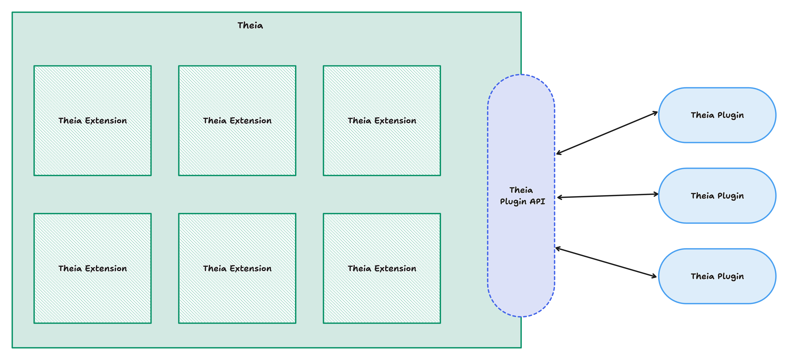
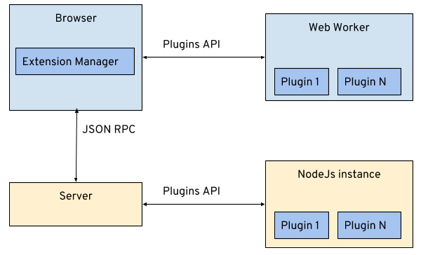
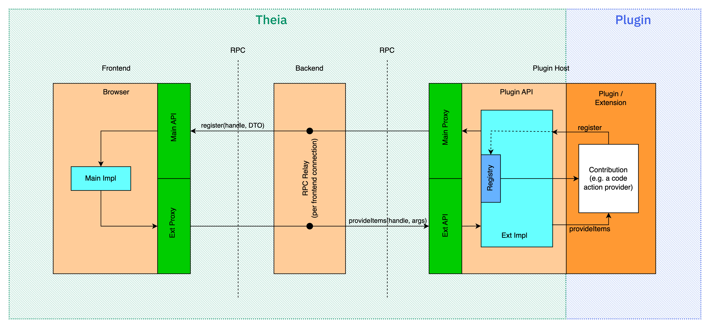
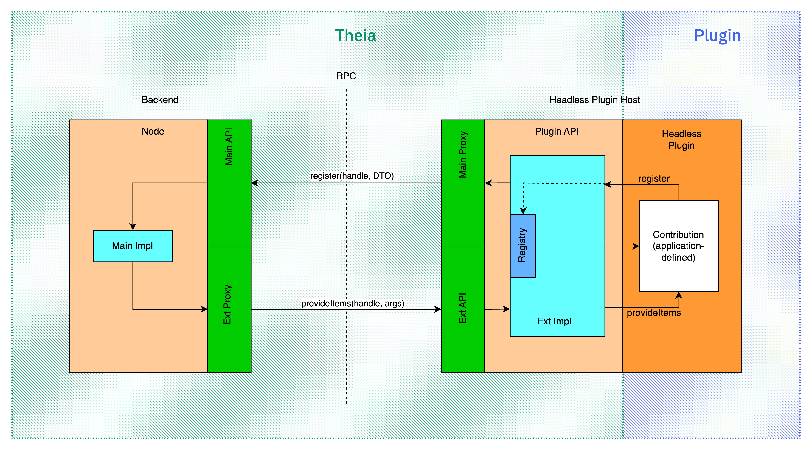

<div align='center'>

<br />


<h1>关于IDE开发框架-Theia的探索</h1>

<hr />

</div>

[Theia](https://github.com/eclipse-theia/theia) 是一个 IDE 开发框架，可以帮助你构建类似于 [VSCode](https://github.com/microsoft/vscode) 的 IDE 应用。VSCode 是微软开源的代码编辑器，通过阅读其源码可以学习到许多业界最佳实践。然而，VSCode 的代码库非常庞大，尽管其代码组织优秀，但在不了解某个模块具体文件夹组织的情况下，通过调试逐步查找是非常困难的。

幸运的是，Theia 复用了许多 VSCode 的功能设计思路，并通过 Monorepo 的方式将各模块拆分开来，方便你阅读和构建自己的 IDE 应用。打个比方，VSCode 就像是一辆完整的汽车，你需要理解整辆车子的构造原理才能修改零件。而 Theia 更像是组成汽车的大部件，告诉你每个部件的用途，帮助你搭建出自己的汽车。

这个项目从一个Theia示例项目[examples/browser](https://github.com/eclipse-theia/theia/tree/master/examples/browser)出发，通过调试[examples/browser](https://github.com/eclipse-theia/theia/tree/master/examples/browser)的方式，进一步阅读Theia项目的核心源码，逐步探索Theia当中如何进行项目组织、如何进行机制设计、如何进行功能开发、如何进行项目编译等相关研发流程，经过这些探索寻找可能让我正在开发的 Gepick（一个图形编辑器）上升一个维度的机会，朝着成为类似于 Theia 的二次开发平台方向推进。

## 探索Theia项目结构

### Theia项目工程结构

Theia 仓库包含多个文件夹：

- [`doc`](https://github.com/eclipse-theia/theia/tree/master/doc) 文件夹提供有关 Theia 工作原理的文档。
- [`dev-packages`](https://github.com/eclipse-theia/theia/tree/master/dev-packages) 文件夹包含开发时需要用到的包。
  - [`@theia/cli`](https://github.com/eclipse-theia/theia/tree/master/dev-packages/cli)是一个用于管理 Theia 应用的命令行工具。
  - [`@theia/ext-scripts`](https://github.com/eclipse-theia/theia/tree/master/dev-packages/private-ext-scripts) 是一个用于在 Theia 运行时包之间共享脚本的命令行工具
- [`packages`](https://github.com/eclipse-theia/theia/tree/master/packages) 文件夹包含运行时需要用到的包，如核心包`@theia/core`及其扩展`@theia/xxx`。
- [`examples`](https://github.com/eclipse-theia/theia/tree/master/examples) 文件夹包含示例应用程序，包括基于 Electron 和基于浏览器的应用程序。
- [`scripts`](https://github.com/eclipse-theia/theia/tree/master/scripts) 文件夹包含在安装时由 npm 脚本使用的 JavaScript 脚本。
- [根文件夹](https://github.com/eclipse-theia/theia/tree/master)列出了开发依赖项，并使用 Lerna 将所有内容连接在一起。

为了方便理解，我将整个Theia仓库分成两大部分：



- Theia内部工程，即除去[`examples`](https://github.com/eclipse-theia/theia/tree/master/examples) 文件夹的剩余部分，Theia框架核心源码。
- 基于“Theia内部工程”开发的应用程序，即[`examples`](https://github.com/eclipse-theia/theia/tree/master/examples) 文件夹的部分，基于Theia开发的IDE应用。

> [!TIP]
>
> 为了方便后续理解，我们会一直沿用**应用程序**和**Theia内部工程**这两个部分的说法来区分**用户基于Theia开发的IDE应用**和**Theia框架主工程**。

### 基于Theia Cli生成Cloud IDE应用工程

[examples/browser](https://github.com/eclipse-theia/theia/tree/master/examples/browser)是[Theia](https://github.com/eclipse-theia/theia)项目中提供的Cloud IDE展示项目，项目按照Browser-Backend的方式运行。与[create-vite cli](https://github.com/vitejs/vite/tree/main/packages/create-vite#readme)能够为你创建基础的前端应用工程类似，你可以通过[@theia/cli](https://github.com/eclipse-theia/theia/tree/master/dev-packages/cli)来创建一系列Theia应用工程。比如，这里我们使用[@theia/cli](https://github.com/eclipse-theia/theia/tree/master/dev-packages/cli)创建生成[examples/browser](https://github.com/eclipse-theia/theia/tree/master/examples/browser)应用工程，为该项目提供相应的源代码和构建配置。生成源码和构建配置的[examples/browser](https://github.com/eclipse-theia/theia/tree/master/examples/browser)主要目录如下：

```shell
├── gen-webpack.config.js
├── gen-webpack.node.config.js
├── node_modules
├── package.json
├── src-gen
│   ├── backend
│   │   ├── main.js
│   │   └── server.js
│   └── frontend
│       ├── index.html
│       ├── index.js
│       ├── secondary-index.js
│       └── secondary-window.html
├── tsconfig.json
└── webpack.config.js
```

其中`src-gen`就是你的app的源码所在目录。`gen-xx`前缀（比如`gen-webpack.config.js`）或者`xx-gen`后缀（比如`src-gen`）代表的是这些东西都是通过[@theia/cli](https://github.com/eclipse-theia/theia/tree/master/dev-packages/cli)的[`build`](https://github.com/eclipse-theia/theia/blob/b80aa74f1c0d8e872a2af20453ce94b9830652de/dev-packages/cli/src/theia.ts#L168)命令生成的。

> [!NOTE]
>
> 如果你对[@theia/cli](https://github.com/eclipse-theia/theia/tree/master/dev-packages/cli)是如何利用`build`命令生成`app`的源代码以及`webpack`配置内容感兴趣，可以阅读文件夹`dev-packages/application-manager/src/generator`中的内容，这里头就是相关源码的模板。
>
> `dev-packages/application-manager/src/generator`目录如下：
>
> ```shell
> ├── abstract-generator.ts # 源码模板抽象类，提供通用功能
> ├── backend-generator.ts # 后端源码模板
> ├── frontend-generator.ts # 前端源码模板
> └── webpack-generator.ts # webpack配置模板
> ```

### 借助tsconfig references字段实现源码跳转

#### 本项目（gpk）操作

在本项目（gpk）根目录下分别执行以下操作并观察现象

- `yarn build`：观察build之后的产物和产物之间的关系，到`apps/browser/src/index.ts`观察导入的`import { main } from "@gpk/p2/lib/browser/frontend-application";`，点击你会发现跳转到的地方是源代码而不是构建产物js的.d.ts文件里头了。同时你会发现产物是按照依赖关系构建的。
- `yarn start`
- `yarn clean`：你会发现相关一连串有关的库的产物会被清理。

tsconfig当中可以配置一个字段references，有啥用举个例子来说明：
在monorepo项目当中，你写了多个包，需要构建成js的dist才能用。此时你在主项目引入这些包，如果没有这个references配置，你点击相关包导出变量，你去到的地方就是该包dist的.d.ts的声明文件，此时你想我希望点击的时候跳转到ts源码可以吗？可以的，配置这个字段，将path指向你的包的tsconfig所在路径就能实现这一点，因此如果你使用了多个包，你就的写多个指向。
当然这个字段的本来作用其实是依赖顺序构建，类似于NX提供的依赖构建顺序问题的解决方案，你可以尝试下这个项目的`yarn build`，你会发现相关联的包都会被构建起来，nx也可以实现同样的功能。因此，对于仅包含 TypeScript 项目并且主要关注增量构建和依赖关系管理的情况，你可以只使用 tsc -b 来处理这些问题，而不需要使用 Nx。tsc -b 可以有效地处理 TypeScript 项目中的依赖关系，并提供增量构建功能。在这部分功能上，Nx和tsc -b的效果都是一样的，都可以进行依赖产物构建，保证主项目正确执行。
在Theia当中，你可以在整个项目很多地方看到这种用法。

### 导入和使用本地package包

在Theia项目中，你经常能看到这种类似的用法`import { CommandContribution, MenuContribution } from '@theia/core/lib/common'`。当你点击对应路径的时候，跳转到的地方是`@theia/core/src/common/index.ts`。这样的效果其实就是通过[ts references作用](#ts-references作用)实现的。在Theia中，具体是这么做的：

- 第一步：注册包 - 在使用`@theia/core`的包`package.json`注册为该包依赖`"@theia/core": "1.53.0"`。
- 第二步：使用包 - 在具体的地方使用`@theia/core`，导入的lib是`@theia/core`构建后的产物：`import { CommandContribution, MenuContribution } from '@theia/core/lib/common'`。
- 第三步：支持点击构建产物路径跳转回源代码：在具体使用的包的`tsconfig.json`中对`references`配置`@theia/core`的包路径，类似于`{ "path": "../core"}`。

在本项目`gpk`中，我们为了更好的路径引用，对于包内部的路径也配置成了绝对路径的方式，比如`core`内部的文件相互引用的时候，是这么用的`import { createServiceIdentifier } from '@gpk/core/common/instantiation';`。具体的绝对路径的引用是通过`tsconfig.base.json`配置的`paths`：`"@gpk/core/*": ["./packages/core/src/*"]`。
因此，如果你在使用`core`包的地方，比如`console`，在里头你会看到两种类似的路径：

- 引用其他包，如`@gpk/core`：`import { IFrontendApplicationContribution } from '@gpk/core/lib/browser/frontend-application/frontend-application-contribution-point';`，注意这里的前缀是`@gpk/core/lib`，这就是`Theia`当中你经常能看到的路径引用方式。
- 引用本包文件：`import { ConsoleContribution, _IConsoleContribution } from '@gpk/console/browser/console-contribution';`，注意这里的前缀是`@gpk/console`。
通过上面引用本包文件的引入方式，你就以避免使用多个相对路径引入本地宝文件，看起来十分直观。但是这里会出现一个问题：构建tsc是不会帮你转换这个绝对路径的，那么最终在构建的js文件如果还是使用`import { ConsoleContribution, _IConsoleContribution } from '@gpk/console/browser/console-contribution';`没有进行相对路径转换，由于压根没有`'@gpk/console/browser/console-contribution'`这个路径的js文件就会导致执行出错。为了解决这一点，我们引入`tsc-alias`这个包来解决这个问题，在`tsc`构建后使用`tsc-alias`将绝对路径转化成相对路径。

### 使用tsc -b构建项目 + 借助vite 二次构建让项目正确运行

为啥使用tsc -b还需要vite进行二次构建呢？当设置package.json中的"type": "module"时，import必须带上文件后缀名，否则node执行会报错。但是，这个不是我们想要的结果，因为我们想要的是在不带后缀名的情况下也能正常导入。我们希望`import { browser } from "@gpk/p2/lib/browser/frontend-application.js"`改成直接使用的是`import { browser } from "@gpk/p2/lib/browser/frontend-application"`。为了解决上面的问题，我们先让tsc build构建相关项目，然后再使用vite二次构建dist内容，最后就可以运行dist内容了。相关讨论：<https://www.reddit.com/r/typescript/comments/1b87o96/esm_on_nodejs_file_extension_mandatory/>。在Theia当中，你会发现创建一个新的IDE项目的时候，Theia会给你搞一堆webpack config，我猜实际上也是为了解决这个问题。

## 探索Theia三大扩展机制

### extension机制

Theia整个架构的核心是围绕inversify开展的。在Theia当中将一个个npm包作为extension的外壳，实际上每个extension的核心是ContainerModule，对于一个extension包根据不同的运行环境可以有多个ContainerModule，他们是Theia加载一个extension的入口。每个extension包可能提供以下部分：

- contribution扩展点
- 完全由内部实现的提供给外部使用的service服务
- 由外部提供的contribution + 内部实现的功能组合而成的service服务

这里我实现了一个console extension，它实现了IFrontendApplicationContribution这个contribution扩展点，IFrontendApplicationContribution是由core extension提供的，在这个示例就是由console extension来实现。
最终的console extension在`apps/browser/src/index.ts`可以看到其实就是container.load暴露的console ContainerModule就OK了。你可以尝试在项目根目录尝试运行`yarn build + yarn start`来查看加载一个`console extension`到主应用的效果。

### contribution机制

contribution机制允许你在Theia应用生命周期过程中对Theia应用的各个部分进行扩展。

Theia的contribution机制技术上实际就是一个extension包提供给外部一些interface 接口，让其他extension包帮忙实现对应的contribution，然后在extension的ContainerModule中绑定到由提供contribution扩展点的extension包提供的contribution service id上。
而提供contribution扩展点的extension包内部怎么获取contribution呢？在Theia当中，你会发现eclipse团队会实现一个contribution provider的玩意，这个玩意装着一组外部实现的contribution，theia里头就是通过contribution provider拿的。这个探索项目并没有按照Theia官方实现那样也实现contribution provider，因为我看了下确实没必要，实现contribution provider的原因我猜他们想解决的就是同一个id多服务实现注入的问题，按照目前最新版本的inversify早就实现了这个功能就是@multiInject这个装饰器，估计当时老版本没有这个东西，所以他么自己实现了类似功能。contribution provider的实现也很简单，代码实现可以自行查看：<https://github.com/eclipse-theia/theia/blob/master/packages/core/src/common/contribution-provider.ts>

### plugin机制



在Theia中支持了运行时动态加载的plugin。用户可以在插件市场点击下载自己希望使用的插件，等待插件下载完毕之后就能够使用该插件的功能了。动态加载plugin的关键技术点就是利用了require()或者是import()，它允许你运行时加载某一个模块。

Theia通过提供Plugin API的方式允许用户插件使用这些Plugin API来做事情。

我们直接看`cloud ide`的前后端部分的主要部分


#### plugin机制启动流程

##### 服务端部分

在文件`examples/browser/src-gen/backend/server.js`中，有一段后端服务启动的代码：

```ts
async function start(port, host, argv = process.argv) {
    if (!container.isBound(BackendApplicationServer)) {
        container.bind(BackendApplicationServer).toConstantValue({ configure: defaultServeStatic });
    }
    let result = undefined;
    await container.get(CliManager).initializeCli(argv.slice(2), 
        () => container.get(BackendApplication).configured,
        async () => {
            result = container.get(BackendApplication).start(port, host);
        });
    if (result) {
        return result;
    } else {
        return Promise.reject(0);
    }
}
```

在`start`函数逻辑运行时，最终可以看到运行的是`container.get(BackendApplication).start(port, host)`。实际上也就是利用`ioc container`创建并获取[`BackendApplication`](https://github.com/eclipse-theia/theia/blob/b80aa74f1c0d8e872a2af20453ce94b9830652de/packages/core/src/node/backend-application.ts#L155)类的实例。在这里由于[`BackendApplication`](https://github.com/eclipse-theia/theia/blob/b80aa74f1c0d8e872a2af20453ce94b9830652de/packages/core/src/node/backend-application.ts#L155)类定义对于[`init`](https://github.com/eclipse-theia/theia/blob/b80aa74f1c0d8e872a2af20453ce94b9830652de/packages/core/src/node/backend-application.ts#L212)方法使用了`postConstruct`装饰器，它的作用是在`ioc container`创建出类实例后调用起来。因此，我们应该将`container.get(BackendApplication).start(port, host)`拆分成两部分来看`const app = container.get(BackendApplication)`和`app.start(port,host)`。前半部分`const app = container.get(BackendApplication)`将创建`BackendApplication`实例，并调用`BackendApplication`实例的`init`方法，后半部分会调用`BackendApplication`实例的`start`方法。

一个`BackendApplication`会有很多`Contribution`。在目前我所调试的版本中，总共有下面这些`Contribution`：

| (index) | `BackendApplication Contribution`       | `File`                                                       | `Method`               |
| ------- | --------------------------------------- | ------------------------------------------------------------ | ---------------------- |
| 0       | `DefaultMessagingService`               | `packages/core/src/node/messaging/default-messaging-service.ts` | `initialize`           |
| 1       | `MyLogger`                              | `packages/core/src/node/logger-backend-module.ts`            | `initialize`           |
| 2       | `PluginLocalizationServer`              | `packages/plugin-ext/src/main/node/plugin-localization-server.ts` | `initialize`           |
| 3       | `PluginDeployerContribution`            | `packages/plugin-ext/src/main/node/plugin-deployer-contribution.ts` | `initialize`           |
| 4       | `WebviewBackendSecurityWarnings`        | `packages/plugin-ext/src/main/node/webview-backend-security-warnings.ts` | `initialize`           |
| 5       | `HostedPluginLocalizationService`       | `packages/plugin-ext/src/hosted/node/hosted-plugin-localization-service.ts` | `initialize`           |
| 6       | `MiniBrowserBackendSecurityWarnings`    | `packages/mini-browser/src/node/mini-browser-backend-security-warnings.ts` | `initialize`           |
| 7       | `HostedPluginReader`                    | `packages/plugin-dev/src/node/hosted-plugin-reader.ts`       | `initialize`           |
| 8       | `NodeFileUploadService`                 | `packages/filesystem/src/node/node-file-upload-service.ts`   | `configure`            |
| 9       | `FileDownloadEndpoint`                  | `packages/filesystem/src/node/download/file-download-endpoint.ts` | `configure`            |
| 10      | `PluginApiContribution`                 | `packages/plugin-ext/src/main/node/plugin-service.ts`        | `configure`            |
| 11      | `HostedPluginReader`                    | `packages/plugin-ext/src/hosted/node/plugin-reader.ts`       | `configure`            |
| 12      | `SampleMockOpenVsxServer`               | `packages/api-samples/src/node/sample-mock-open-vsx-server.ts` | `configure \| onStart` |
| 13      | `MiniBrowserEndpoint`                   | `packages/mini-browser/src/node/mini-browser-endpoint.ts`    | `configure \| onStart` |
| 14      | `MetricsBackendApplicationContribution` | `packages/metrics/src/node/metrics-backend-application-contribution.ts` | `configure \| onStart` |
| 15      | `WebsocketEndpoint`                     | `packages/core/src/node/messaging/websocket-endpoint.ts`     | `onStart`              |
| 16      | `DefaultWorkspaceServer`                | `packages/workspace/src/node/default-workspace-server.ts`    | `onStart`              |
| 17      | `TaskBackendApplicationContribution`    | `packages/task/src/node/task-backend-application-contribution.ts` | `onStart`              |
| 18      | `MyHeadlessHostedPluginSupport`         | `packages/plugin-ext-headless/src/hosted/node/plugin-ext-headless-hosted-module.ts` | `onStart`              |
| 19      | `SampleBackendAppInfo`                  | `packages/api-samples/src/node/sample-backend-app-info.ts`   | `onStart`              |
| 20      | `Object`                                | `undefined`                                                  | ``                     |
| 21      | `ProcessManager`                        | `packages/process/src/node/process-manager.ts`               | ``                     |
| 22      | `TaskManager`                           | `packages/task/src/node/task-manager.ts`                     | ``                     |

##### BackendApplication 初始化阶段

在执行`BackendApplication`的`init`方法时，内部的关键一段逻辑是:

```ts
const contributions = this.contributionsProvider.getContributions()

await Promise.all(contributions.map(async contribution => {
  if (contribution.initialize) {
    try {
       contribution.initialize!()
     } catch (error) {
       console.error('Could not initialize contribution', error);
     }   
  }
}));
```

这将会调用下面的这些`Contribution`的`initialize`方法：

| (index) | `BackendApplication Contribution`       | `File`                                                                                       | `Method`     |
|---------|-----------------------------------------|----------------------------------------------------------------------------------------------|--------------|
| 0       | `DefaultMessagingService`               | `packages/core/src/node/messaging/default-messaging-service.ts`                              | `initialize` |
| 1       | `MyLogger`                              | `packages/core/src/node/logger-backend-module.ts`                                            | `initialize` |
| 2       | `PluginLocalizationServer`              | `packages/plugin-ext/src/main/node/plugin-localization-server.ts`                            | `initialize` |
| 3       | `PluginDeployerContribution`            | `packages/plugin-ext/src/main/node/plugin-deployer-contribution.ts`                          | `initialize` |
| 4       | `WebviewBackendSecurityWarnings`        | `packages/plugin-ext/src/main/node/webview-backend-security-warnings.ts`                     | `initialize` |
| 5       | `HostedPluginLocalizationService`       | `packages/plugin-ext/src/hosted/node/hosted-plugin-localization-service.ts`                  | `initialize` |
| 6       | `MiniBrowserBackendSecurityWarnings`    | `packages/mini-browser/src/node/mini-browser-backend-security-warnings.ts`                   | `initialize` |
| 7       | `HostedPluginReader`                    | `packages/plugin-dev/src/node/hosted-plugin-reader.ts`                                       | `initialize` |

这个阶段，对于`Plugin`机制，我们主要关注`PluginDeployerContribution`的`initialize`过程。它位于`packages/plugin-ext/src/main/node/plugin-deployer-contribution.ts`文件中，我们看看它的`initialize`方法的关键部分：

```ts
initialize(): Promise<void> {
 // 这里注入的是packages/plugin-ext/src/main/node/plugin-deployer-impl.ts
  this.pluginDeployer.start().catch(error => this.logger.error('Initializing plugin deployer failed.', error));
  return Promise.resolve();
}
```

实际上最关键的内容是`this.pluginDeployer.start()`。而`pluginDepolyer`是通过依赖注入的方式提供给`PluginDeployerContribution`使用的，它的实际实现位置在`packages/plugin-ext/src/main/node/plugin-deployer-impl.ts`。进入该文件，我们看下`pluginDeployer`的实现定义，即`PluginDeployerImpl`类，找到该类的`start`方法定义，实际上只是做了一层转发，调用的是该类的`doStart`方法。我们看看`doStart`的关键内容：

```typescript
protected async doStart(): Promise<void> {
    // ====================初始化所有插件解析器（vscode、theia有几种解析器）====================
    await this.initResolvers();

    // check THEIA_DEFAULT_PLUGINS or THEIA_PLUGINS env var
    const defaultPluginsValue = process.env.THEIA_DEFAULT_PLUGINS || undefined;
    const pluginsValue = process.env.THEIA_PLUGINS || undefined;
    // 拿到插件目录，比如这里就是整个根目录中的plugins目录
    // 这个插件目录可以在命令后启动后端app的时候，通过--plugins参数指定
  // 比如：yarn theia start --plugins=/Users/work/Third-Projects/theia/plugins
    const defaultPluginsValueViaCli = this.cliContribution.localDir();
    const defaultPluginIdList = defaultPluginsValue ? defaultPluginsValue.split(',') : [];
    const pluginIdList = pluginsValue ? pluginsValue.split(',') : [];
    const systemEntries = defaultPluginIdList.concat(pluginIdList).concat(defaultPluginsValueViaCli ? defaultPluginsValueViaCli.split(',') : []);
    const userEntries: string[] = [];
    const context: PluginDeployerStartContext = { userEntries, systemEntries };

    // 获取各种插件解析器读取的插件目录入口
    const contributions = this.participants.getContributions();

    for (const contribution of contributions) {
        if (contribution.onWillStart) {
            await contribution.onWillStart(context);
        }
    }

    // ====================解析插件=================
    const unresolvedUserEntries = context.userEntries.map(id => ({
        id,
        type: PluginType.User
    }));

    const unresolvedSystemEntries = context.systemEntries.map(id => ({
        id,
        type: PluginType.System
    }));

    // 利用图的bfs解析所有插件入口。往往我们给定一个插件，但是这个插件又依赖其他插件，所以我们需要解析所有插件及其依赖插件
    // 只有这样才能真正的部署所有插件
    const plugins = await this.resolvePlugins([...unresolvedUserEntries, ...unresolvedSystemEntries]);

    // ====================部署插件=================
    await this.deployPlugins(plugins);
}
````

由此可见，`PluginDeployerContribution`在初始化的时候完成的事情是：解析插件和部署插件。即利用各种种类的插件解析器去解析自订插件目录下的插件，然后部署这些插件。

> [!NOTE]
>
> 对于插件部署这件事，实际上就是读取插件的相关元信息，以及类型。一个已部署的插件是这么做的，定义一个变量并设置到`deployedPlugins`中而已：`const deployed: DeployedPlugin = { metadata, type }; deployedPlugins.set(id, deployed);`，这些逻辑都放在`HostedPluginDeployerHandler`类中，该类位于`packages/plugin-ext/src/hosted/node/hosted-plugin-deployer-handler.ts`文件中。

##### BackendApplication 启动阶段

在执行`BackendApplication`的`start`方法时，内部的关键一段逻辑是:

```ts
 const contributions = this.contributionsProvider.getContributions()
 
 for (const contribution of contributions) {
   if (contribution.onStart) {
      try {
            await this.measure(contribution.constructor.name + '.onStart',
             () => contribution.onStart!(server)
            );
          } catch (error) {
            console.error('Could not start contribution', error);
       } 
   }
}
```

这将会调用下面的`Contribution`的`onStart`方法：

| (index) | `BackendApplication Contribution`       | `File`                                                       | `Method`  |
| ------- | --------------------------------------- | ------------------------------------------------------------ | --------- |
| 0       | `SampleMockOpenVsxServer`               | `packages/api-samples/src/node/sample-mock-open-vsx-server.ts` | `onStart` |
| 1       | `MiniBrowserEndpoint`                   | `packages/mini-browser/src/node/mini-browser-endpoint.ts`    | `onStart` |
| 2       | `MetricsBackendApplicationContribution` | `packages/metrics/src/node/metrics-backend-application-contribution.ts` | `onStart` |
| 3       | `WebsocketEndpoint`                     | `packages/core/src/node/messaging/websocket-endpoint.ts`     | `onStart` |
| 4       | `DefaultWorkspaceServer`                | `packages/workspace/src/node/default-workspace-server.ts`    | `onStart` |
| 5       | `TaskBackendApplicationContribution`    | `packages/task/src/node/task-backend-application-contribution.ts` | `onStart` |
| 6       | `MyHeadlessHostedPluginSupport`         | `packages/plugin-ext-headless/src/hosted/node/plugin-ext-headless-hosted-module.ts` | `onStart` |
| 7       | `SampleBackendAppInfo`                  | `packages/api-samples/src/node/sample-backend-app-info.ts`   | `onStart` |

这个阶段，对于`Plugin`机制，我们主要关注`MyHeadlessHostedPluginSupport`的`onStart`过程。它位于`packages/plugin-ext-headless/src/hosted/node/plugin-ext-headless-hosted-module.ts`文件中，我们看看它的`onStart`关键内容：

```ts
bind(BackendApplicationContribution).toDynamicValue(({ container }) => {
    let hostedPluginSupport: HeadlessHostedPluginSupport | undefined;

    class MyHeadlessHostedPluginSupport {
        onStart(): MaybePromise<void> {
            // Create a child container to isolate the Headless Plugin hosting stack
            // from all connection-scoped frontend/backend plugin hosts and
            // also to avoid leaking it into the global container scope
            const headlessPluginsContainer = container.createChild();
            const modules = container.getAll<ContainerModule>(HeadlessPluginContainerModule);

            headlessPluginsContainer.load(...modules);

            hostedPluginSupport = headlessPluginsContainer.get(HeadlessHostedPluginSupport);

            // plugin-ext-headless依赖于plugin-ext包的packages/plugin-ext/src/hosted/common/hosted-plugin.ts
            hostedPluginSupport.onStart(headlessPluginsContainer);
        }

        onStop(): void {
            hostedPluginSupport?.shutDown();
        }
    }
    return new MyHeadlessHostedPluginSupport();
});
```

这里边最关键的部分是`hostedPluginSupport.onStart(headlessPluginsContainer)`，`hostedPluginSupport`是`HeadlessHostedPluginSupport`创建的实例，而`HeadlessHostedPluginSupport`位于`packages/plugin-ext-headless/src/hosted/node/headless-hosted-plugin.ts`文件中。而`HeadlessHostedPluginSupport`又是继承自`AbstractHostedPluginSupport`，它位于`packages/plugin-ext/src/hosted/common/hosted-plugin.ts`文件中。`onStart`方法正是定义在它身上的：

```ts
 onStart(container: interfaces.Container): void {
   this.container = container;
   this.load();
   this.afterStart();
}
```

关键的部分是`this.load()`，而在`load`方法中最核心的内容就是`this.doLoad()`，我们继续看下`doLoad`的关键定义：

```ts
protected async doLoad(): Promise<void> {

    // ==============同步所有插件 start============
    await this.syncPlugins();
    // ==============同步所有插件 end============

    // ==============加载所有插件贡献 start============
    // 实际上就是将每个plugin的contributions分类注册
    // 比如contribute的地方有command、theme等地方，意思是写的plugin是对这些地方的扩展
    // 所以你会看到contributions.command，contributions.theme等 类似这样的内容，将plugin里头这些内容一个个注册
    // 这个部分简而言之，就是将一个theia向插件暴露的可contribute的地方，一个个处理，如果有就调用相关处理逻辑，没有就跳过
    const contributionsByHost = this.loadContributions(toDisconnect);
    // ==============加载所有插件贡献 end============

    // ==============等待Theia App（前端App或者后端App）启动完成 start=============
    await this.theiaReadyPromise;
    // ==============等待Theia App（前端App或者后端App）启动完成 end=============

    // ==============启动所有插件 start============
    // 启动所有需要加载的插件
    await this.startPlugins(contributionsByHost, toDisconnect);
    // ==============启动所有插件 end============
}
```

由此可见，`MyHeadlessHostedPluginSupport`这个`Contribution`做的事情是针对`Headless Plugin`的相关操作：同步插件、加载插件`Contribution`、启动插件。

##### 客户端部分

在`examples/browser/src-gen/frontend/index.js`文件中，有一段关于启动前端应用的代码：

```ts
function start() {

   (window['theia'] = window['theia'] || {}).container = container;

  return container.get(FrontendApplication).start();

}
```

这其中关键的部分是`container.get(FrontendApplication).start()`。我们按照之前的方式，同样的分成`const app = container.get(FrontendApplication)` 和 `app.start()`两部分，从这两部分分析`app`可能经历的两个阶段：初始化阶段和启动阶段。`FrontendApplication`位于`packages/core/src/browser/frontend-application.ts`文件中，我们观察发现并没有使用`postConstruct`的地方，所以`FrontendApplication`的初始化阶段可忽略。我们直接看启动阶段，找到`start`方法中关于`Contribution`有关的内容，这里为了更清晰表达，我改造了下：

```ts
async start(): Promise<void> {
  await this.initializeContributions()
  await this.configureContributions()
  await this.startContributions()
}

protected async initializeContributions(): Promise<void> {
    for (const contribution of this.contributions.getContributions()) {
        if (contribution.initialize) {
            contribution.initialize!()
        }
    }
}

protected async configureContributions(): Promise<void> {
    for (const contribution of this.contributions.getContributions()) {
        if (contribution.configure) {
            await contribution.configure!(this)
        }
    }
}

protected async startContributions(): Promise<void> {
    this.commands.onStart()
    this.keybindings.onStart()
    this.menus.onStart()

    for (const contribution of this.contributions.getContributions()) {
        if (contribution.onStart) {
           await contribution.onStart!(this)
        }
    }
}
```

一个`FrontendApplication`会有很多`Contribution`。在目前我所调试的版本中，总共有下面这些`Contribution`：

| (index) | `FrontendApplication Contribution`        | `File`                                                       | `Method`                |
| ------- | ----------------------------------------- | ------------------------------------------------------------ | ----------------------- |
| 0       | `TabBarDecoratorService`                  | `packages/core/src/browser/shell/tab-bar-decorator.ts`       | `initialize`            |
| 1       | `LabelProvider`                           | `packages/core/src/browser/label-provider.ts`                | `initialize`            |
| 2       | `ApplicationConnectionStatusContribution` | `packages/core/src/browser/connection-status-service.ts`     | `initialize`            |
| 3       | `DialogOverlayService`                    | `packages/core/src/browser/dialogs.ts`                       | `initialize`            |
| 4       | `MyLogger`                                | `packages/core/src/browser/logger-frontend-module.ts`        | `initialize`            |
| 5       | `FileSystemFrontendContribution`          | `packages/filesystem/src/browser/filesystem-frontend-contribution.ts` | `initialize \| onStart` |
| 6       | `ProblemDecorationContribution`           | `packages/markers/src/browser/problem/problem-decorations-provider.ts` | `initialize`            |
| 7       | `MonacoFrontendApplicationContribution`   | `packages/monaco/src/browser/monaco-frontend-application-contribution.ts` | `initialize \| onStart` |
| 8       | `MonacoFormattingConflictsContribution`   | `packages/monaco/src/browser/monaco-formatting-conflicts.ts` | `initialize`            |
| 9       | `MonacoTextmateService`                   | `packages/monaco/src/browser/textmate/monaco-textmate-service.ts` | `initialize`            |
| 10      | `ConsoleContribution`                     | `packages/console/src/browser/console-contribution.ts`       | `initialize`            |
| 11      | `WebviewFrontendSecurityWarnings`         | `packages/plugin-ext/src/main/browser/webview/webview-frontend-security-warnings.ts` | `initialize`            |
| 12      | `MiniBrowserFrontendSecurityWarnings`     | `packages/mini-browser/src/browser/mini-browser-frontend-security-warnings.ts` | `initialize`            |
| 13      | `MetricsFrontendApplicationContribution`  | `packages/metrics/src/browser/metrics-frontend-application-contribution.ts` | `initialize`            |
| 14      | `HostedPluginInformer`                    | `packages/plugin-dev/src/browser/hosted-plugin-informer.ts`  | `initialize`            |
| 15      | `HostedPluginController`                  | `packages/plugin-dev/src/browser/hosted-plugin-controller.ts` | `initialize`            |
| 16      | `CommonFrontendContribution`              | `packages/core/src/browser/common-frontend-contribution.ts`  | `configure \| onStart`  |
| 17      | `WorkspaceUserWorkingDirectoryProvider`   | `packages/workspace/src/browser/workspace-user-working-directory-provider.ts` | `configure`             |
| 18      | `WorkspaceFrontendContribution`           | `packages/workspace/src/browser/workspace-frontend-contribution.ts` | `configure`             |
| 19      | `IconThemeApplicationContribution`        | `packages/core/src/browser/icon-theme-contribution.ts`       | `onStart`               |
| 20      | `ColorApplicationContribution`            | `packages/core/src/browser/color-application-contribution.ts` | `onStart`               |
| 21      | `TabBarToolbarRegistry`                   | `packages/core/src/browser/shell/tab-bar-toolbar/tab-bar-toolbar-registry.ts` | `onStart`               |
| 22      | `QuickInputFrontendContribution`          | `packages/core/src/browser/quick-input/quick-input-frontend-contribution.ts` | `onStart`               |
| 23      | `JsonSchemaStore`                         | `packages/core/src/browser/json-schema-store.ts`             | `onStart`               |
| 24      | `ApplicationShellMouseTracker`            | `packages/core/src/browser/shell/application-shell-mouse-tracker.ts` | `onStart`               |
| 25      | `WorkspaceWindowTitleUpdater`             | `packages/workspace/src/browser/workspace-window-title-updater.ts` | `onStart`               |
| 26      | `StylingService`                          | `packages/core/src/browser/styling-service.ts`               | `onStart`               |
| 27      | `BrowserMenuBarContribution`              | `packages/core/src/browser/menu/browser-menu-plugin.ts`      | `onStart`               |
| 28      | `DefaultWindowService`                    | `packages/core/src/browser/window/default-window-service.ts` | `onStart`               |
| 29      | `VariableResolverFrontendContribution`    | `packages/variable-resolver/src/browser/variable-resolver-frontend-contribution.ts` | `onStart`               |
| 30      | `EditorContribution`                      | `packages/editor/src/browser/editor-contribution.ts`         | `onStart`               |
| 31      | `EditorLineNumberContribution`            | `packages/editor/src/browser/editor-linenumber-contribution.ts` | `onStart`               |
| 32      | `EditorNavigationContribution`            | `packages/editor/src/browser/editor-navigation-contribution.ts` | `onStart`               |
| 33      | `ProblemContribution`                     | `packages/markers/src/browser/problem/problem-contribution.ts` | `onStart`               |
| 34      | `MonacoOutlineContribution`               | `packages/monaco/src/browser/monaco-outline-contribution.ts` | `onStart`               |
| 35      | `MonacoStatusBarContribution`             | `packages/monaco/src/browser/monaco-status-bar-contribution.ts` | `onStart`               |
| 36      | `TerminalFrontendContribution`            | `packages/terminal/src/browser/terminal-frontend-contribution.ts` | `onStart`               |
| 37      | `TaskFrontendContribution`                | `packages/task/src/browser/task-frontend-contribution.ts`    | `onStart`               |
| 38      | `NavigatorTabBarDecorator`                | `packages/navigator/src/browser/navigator-tab-bar-decorator.ts` | `onStart`               |
| 39      | `DebugInlineValueDecorator`               | `packages/debug/src/browser/editor/debug-inline-value-decorator.ts` | `onStart`               |
| 40      | `DebugFrontendApplicationContribution`    | `packages/debug/src/browser/debug-frontend-application-contribution.ts` | `onStart`               |
| 41      | `NotificationsContribution`               | `packages/messages/src/browser/notifications-contribution.ts` | `onStart`               |
| 42      | `NotebookOutlineContribution`             | `packages/notebook/src/browser/contributions/notebook-outline-contribution.ts` | `onStart`               |
| 43      | `NotebookStatusBarContribution`           | `packages/notebook/src/browser/contributions/notebook-status-bar-contribution.ts` | `onStart`               |
| 44      | `PreferenceFrontendContribution`          | `packages/preferences/src/browser/preference-frontend-contribution.ts` | `onStart`               |
| 45      | `ScmContribution`                         | `packages/scm/src/browser/scm-contribution.ts`               | `onStart`               |
| 46      | `MyBrowserHostedPluginSupport`            | `packages/plugin-ext/src/main/browser/plugin-ext-frontend-module.ts` | `onStart`               |
| 47      | `WebviewSecondaryWindowSupport`           | `packages/plugin-ext/src/main/browser/webview/webview-secondary-window-support.ts` | `onStart`               |
| 48      | `SampleOutputChannelWithSeverity`         | `examples/api-samples/src/browser/output/sample-output-channel-with-severity.ts` | `onStart`               |
| 49      | `SampleFileWatchingContribution`          | `examples/api-samples/src/browser/file-watching/sample-file-watching-contribution.ts` | `onStart`               |
| 50      | `MiniBrowserOpenHandler`                  | `packages/mini-browser/src/browser/mini-browser-open-handler.ts` | `onStart`               |
| 51      | `MiniBrowserEnvironment`                  | `packages/mini-browser/src/browser/environment/mini-browser-environment.ts` | `onStart`               |
| 52      | `PreviewContribution`                     | `packages/preview/src/browser/preview-contribution.ts`       | `onStart`               |
| 53      | `GettingStartedContribution`              | `packages/getting-started/src/browser/getting-started-contribution.ts` | `onStart`               |
| 54      | `PreferenceServiceImpl`                   | `packages/core/src/browser/preferences/preference-service.ts` | ``                      |
| 55      | `FilesystemSaveableService`               | `packages/filesystem/src/browser/filesystem-saveable-service.ts` | ``                      |
| 56      | `CollaborationWorkspaceService`           | `packages/collaboration/src/browser/collaboration-workspace-service.ts` | ``                      |
| 57      | `OutlineViewContribution`                 | `packages/outline-view/src/browser/outline-view-contribution.ts` | ``                      |
| 58      | `BulkEditContribution`                    | `packages/bulk-edit/src/browser/bulk-edit-contribution.ts`   | ``                      |
| 59      | `FileNavigatorContribution`               | `packages/navigator/src/browser/navigator-contribution.ts`   | ``                      |
| 60      | `TestViewContribution`                    | `packages/test/src/browser/view/test-view-contribution.ts`   | ``                      |
| 61      | `EditorPreviewTreeDecorator`              | `packages/editor-preview/src/browser/editor-preview-tree-decorator.ts` | ``                      |
| 62      | `SearchInWorkspaceFrontendContribution`   | `packages/search-in-workspace/src/browser/search-in-workspace-frontend-contribution.ts` | ``                      |
| 63      | `WebviewContextKeys`                      | `packages/plugin-ext/src/main/browser/webview/webview-context-keys.ts` | ``                      |
| 64      | `PluginViewRegistry`                      | `packages/plugin-ext/src/main/browser/view/plugin-view-registry.ts` | ``                      |
| 65      | `PluginIconService`                       | `packages/plugin-ext/src/main/browser/plugin-icon-service.ts` | ``                      |
| 66      | `VSXExtensionsContribution`               | `packages/vsx-registry/src/browser/vsx-extensions-contribution.ts` | ``                      |
| 67      | `DebugFrontendContribution`               | `packages/memory-inspector/src/browser/memory-inspector-frontend-contribution.ts` | ``                      |

##### FrontendApplication 启动阶段

和后端服务不同，在前端应用启动的时候，才会一次性将`Contribution`的`initialize`、`configure`、`onStart`方法分别调用起来。

能够调用`initialize`方法的`Contribution`有：

| (index) | `FrontendApplication Contribution`                | `File`                                                                                       | `Method`     |
|---------|---------------------------------------------------|----------------------------------------------------------------------------------------------|--------------|
| 0       | `TabBarDecoratorService`                          | `packages/core/src/browser/shell/tab-bar-decorator.ts`                                       | `initialize` |
| 1       | `LabelProvider`                                   | `packages/core/src/browser/label-provider.ts`                                                | `initialize` |
| 2       | `ApplicationConnectionStatusContribution`         | `packages/core/src/browser/connection-status-service.ts`                                     | `initialize` |
| 3       | `DialogOverlayService`                            | `packages/core/src/browser/dialogs.ts`                                                       | `initialize` |
| 4       | `MyLogger`                                        | `packages/core/src/browser/logger-frontend-module.ts`                                        | `initialize` |
| 5       | `FileSystemFrontendContribution`                  | `packages/filesystem/src/browser/filesystem-frontend-contribution.ts`                        | `initialize \| onStart` |
| 6       | `ProblemDecorationContribution`                   | `packages/markers/src/browser/problem/problem-decorations-provider.ts`                       | `initialize` |
| 7       | `MonacoFrontendApplicationContribution`           | `packages/monaco/src/browser/monaco-frontend-application-contribution.ts`                    | `initialize \| onStart` |
| 8       | `MonacoFormattingConflictsContribution`           | `packages/monaco/src/browser/monaco-formatting-conflicts.ts`                                 | `initialize` |
| 9       | `MonacoTextmateService`                           | `packages/monaco/src/browser/textmate/monaco-textmate-service.ts`                            | `initialize` |
| 10      | `ConsoleContribution`                             | `packages/console/src/browser/console-contribution.ts`                                       | `initialize` |
| 11      | `WebviewFrontendSecurityWarnings`                 | `packages/plugin-ext/src/main/browser/webview/webview-frontend-security-warnings.ts`         | `initialize` |
| 12      | `MiniBrowserFrontendSecurityWarnings`             | `packages/mini-browser/src/browser/mini-browser-frontend-security-warnings.ts`               | `initialize` |
| 13      | `MetricsFrontendApplicationContribution`          | `packages/metrics/src/browser/metrics-frontend-application-contribution.ts`                  | `initialize` |
| 14      | `HostedPluginInformer`                            | `packages/plugin-dev/src/browser/hosted-plugin-informer.ts`                                  | `initialize` |
| 15      | `HostedPluginController`                          | `packages/plugin-dev/src/browser/hosted-plugin-controller.ts`                                | `initialize` |

能调用`configure`方法的`Contribution`有：

| (index) | `FrontendApplication Contribution`                | `File`                                                                                       | `Method`     |
|---------|---------------------------------------------------|----------------------------------------------------------------------------------------------|--------------|
| 0       | `CommonFrontendContribution`                      | `packages/core/src/browser/common-frontend-contribution.ts`                                  | `configure` |
| 1       | `WorkspaceUserWorkingDirectoryProvider`           | `packages/workspace/src/browser/workspace-user-working-directory-provider.ts`                | `configure`  |
| 2       | `WorkspaceFrontendContribution`                   | `packages/workspace/src/browser/workspace-frontend-contribution.ts`                          | `configure`  |

能调用`onStart`方法的`Contribution`有:

| (index) | `FrontendApplication Contribution`                | `File`                                                                                       | `Method`     |
|---------|---------------------------------------------------|----------------------------------------------------------------------------------------------|--------------|
| 0       | `FileSystemFrontendContribution`                  | `packages/filesystem/src/browser/filesystem-frontend-contribution.ts`                        | `onStart`    |
| 1       | `MonacoFrontendApplicationContribution`           | `packages/monaco/src/browser/monaco-frontend-application-contribution.ts`                    | `onStart`    |
| 2       | `CommonFrontendContribution`                      | `packages/core/src/browser/common-frontend-contribution.ts`                                  | `onStart`    |
| 3       | `IconThemeApplicationContribution`                | `packages/core/src/browser/icon-theme-contribution.ts`                                       | `onStart`    |
| 4       | `ColorApplicationContribution`                    | `packages/core/src/browser/color-application-contribution.ts`                                | `onStart`    |
| 5       | `TabBarToolbarRegistry`                           | `packages/core/src/browser/shell/tab-bar-toolbar/tab-bar-toolbar-registry.ts`                | `onStart`    |
| 6       | `QuickInputFrontendContribution`                  | `packages/core/src/browser/quick-input/quick-input-frontend-contribution.ts`                 | `onStart`    |
| 7       | `JsonSchemaStore`                                 | `packages/core/src/browser/json-schema-store.ts`                                             | `onStart`    |
| 8       | `ApplicationShellMouseTracker`                    | `packages/core/src/browser/shell/application-shell-mouse-tracker.ts`                         | `onStart`    |
| 9       | `WorkspaceWindowTitleUpdater`                     | `packages/workspace/src/browser/workspace-window-title-updater.ts`                           | `onStart`    |
| 10      | `StylingService`                                  | `packages/core/src/browser/styling-service.ts`                                               | `onStart`    |
| 11      | `BrowserMenuBarContribution`                      | `packages/core/src/browser/menu/browser-menu-plugin.ts`                                      | `onStart`    |
| 12      | `DefaultWindowService`                            | `packages/core/src/browser/window/default-window-service.ts`                                 | `onStart`    |
| 13      | `VariableResolverFrontendContribution`            | `packages/variable-resolver/src/browser/variable-resolver-frontend-contribution.ts`          | `onStart`    |
| 14      | `EditorContribution`                              | `packages/editor/src/browser/editor-contribution.ts`                                         | `onStart`    |
| 15      | `EditorLineNumberContribution`                    | `packages/editor/src/browser/editor-linenumber-contribution.ts`                              | `onStart`    |
| 16      | `EditorNavigationContribution`                    | `packages/editor/src/browser/editor-navigation-contribution.ts`                              | `onStart`    |
| 17      | `ProblemContribution`                             | `packages/markers/src/browser/problem/problem-contribution.ts`                               | `onStart`    |
| 18      | `MonacoOutlineContribution`                       | `packages/monaco/src/browser/monaco-outline-contribution.ts`                                 | `onStart`    |
| 19      | `MonacoStatusBarContribution`                     | `packages/monaco/src/browser/monaco-status-bar-contribution.ts`                              | `onStart`    |
| 20      | `TerminalFrontendContribution`                    | `packages/terminal/src/browser/terminal-frontend-contribution.ts`                            | `onStart`    |
| 21      | `TaskFrontendContribution`                        | `packages/task/src/browser/task-frontend-contribution.ts`                                    | `onStart`    |
| 22      | `NavigatorTabBarDecorator`                        | `packages/navigator/src/browser/navigator-tab-bar-decorator.ts`                              | `onStart`    |
| 23      | `DebugInlineValueDecorator`                       | `packages/debug/src/browser/editor/debug-inline-value-decorator.ts`                          | `onStart`    |
| 24      | `DebugFrontendApplicationContribution`            | `packages/debug/src/browser/debug-frontend-application-contribution.ts`                      | `onStart`    |
| 25      | `NotificationsContribution`                       | `packages/messages/src/browser/notifications-contribution.ts`                                | `onStart`    |
| 26      | `NotebookOutlineContribution`                     | `packages/notebook/src/browser/contributions/notebook-outline-contribution.ts`               | `onStart`    |
| 27      | `NotebookStatusBarContribution`                   | `packages/notebook/src/browser/contributions/notebook-status-bar-contribution.ts`            | `onStart`    |
| 28      | `PreferenceFrontendContribution`                  | `packages/preferences/src/browser/preference-frontend-contribution.ts`                       | `onStart`    |
| 29      | `ScmContribution`                                 | `packages/scm/src/browser/scm-contribution.ts`                                               | `onStart`    |
| 30      | `MyBrowserHostedPluginSupport`                    | `packages/plugin-ext/src/main/browser/plugin-ext-frontend-module.ts`                         | `onStart`    |
| 31      | `WebviewSecondaryWindowSupport`                   | `packages/plugin-ext/src/main/browser/webview/webview-secondary-window-support.ts`           | `onStart`    |
| 32      | `SampleOutputChannelWithSeverity`                 | `examples/api-samples/src/browser/output/sample-output-channel-with-severity.ts`             | `onStart`    |
| 33      | `SampleFileWatchingContribution`                  | `examples/api-samples/src/browser/file-watching/sample-file-watching-contribution.ts`        | `onStart`    |
| 34      | `MiniBrowserOpenHandler`                          | `packages/mini-browser/src/browser/mini-browser-open-handler.ts`                             | `onStart`    |
| 35      | `MiniBrowserEnvironment`                          | `packages/mini-browser/src/browser/environment/mini-browser-environment.ts`                  | `onStart`    |
| 36      | `PreviewContribution`                             | `packages/preview/src/browser/preview-contribution.ts`                                       | `onStart`    |
| 37      | `GettingStartedContribution`                      | `packages/getting-started/src/browser/getting-started-contribution.ts`                       | `onStart`    |

在这几个`Contribution`生命周期中，我们着重关注`onStart`阶段，在前端应用启动的时候会依次调用所有contribution `onStart`方法，因此会将`packages/plugin-ext/src/main/browser/plugin-ext-frontend-module.ts`文件中定义的`FrontendApplicationContribution`实现的对象身上`onStart`方法调用起来。该段代码关键内容如下：

```typescript
  bind(FrontendApplicationContribution).toDynamicValue(ctx => {
      class MyBrowserHostedPluginSupport {
          onStart(): MaybePromise<void> {
              ctx.container.get(HostedPluginSupport).onStart(ctx.container);
          }
      }

      return new MyBrowserHostedPluginSupport()
  });
```

关键的逻辑就是将类`HostedPluginSupport`的实例获取，并调用其`onStart`方法启动插件功能。我们进入`HostedPluginSupport`类所在的`packages/plugin-ext/src/hosted/browser/hosted-plugin.ts`文件中。而在`HostedPluginSupport`类定义的地方我们发现它是继承自`AbstractHostedPluginSupport`类，它位于`packages/plugin-ext/src/hosted/common/hosted-plugin.ts`文件中。

`onStart`方法正是定义在`AbstractHostedPluginSupport`身上的：

```ts
 onStart(container: interfaces.Container): void {
   this.container = container;
   this.load();
   this.afterStart();
}
```

关键的部分是`this.load()`，而在`load`方法中最核心的内容就是`this.doLoad()`，我们继续看下`doLoad`的关键定义：

```ts
protected async doLoad(): Promise<void> {

    // ==============同步所有插件 start============
    await this.syncPlugins();
    // ==============同步所有插件 end============

    // ==============加载所有插件贡献 start============
    // 实际上就是将每个plugin的contributions分类注册
    // 比如contribute的地方有command、theme等地方，意思是写的plugin是对这些地方的扩展
    // 所以你会看到contributions.command，contributions.theme等 类似这样的内容，将plugin里头这些内容一个个注册
    // 这个部分简而言之，就是将一个theia向插件暴露的可contribute的地方，一个个处理，如果有就调用相关处理逻辑，没有就跳过
    const contributionsByHost = this.loadContributions(toDisconnect);
    // ==============加载所有插件贡献 end============

    // ==============等待Theia App（前端App或者后端App）启动完成 start=============
    await this.theiaReadyPromise;
    // ==============等待Theia App（前端App或者后端App）启动完成 end=============

    // ==============启动所有插件 start============
    // 启动所有需要加载的插件
    await this.startPlugins(contributionsByHost, toDisconnect);
    // ==============启动所有插件 end============
}
```

由此可见，`MyBrowserHostedPluginSupport`这个`Contribution`做的事情是针对`Plugin`的相关操作：同步插件、加载插件`Contribution`、启动插件。

#### plugin-host插件进程


上面可以看到，在前端`MyBrowserHostedPluginSupport`这个`Contribution`做的事情是针对`Plugin`的相关操作：同步插件、加载插件`Contribution`、启动插件。但是我们debug启动整个项目后，会发现调用栈中可以看到至少两个不同的进程，一个是后端服务`main`主进程，一个是叫做`plugin-host`的子进程。`main`主进程是后端服务启动的时候出现的，那么`plugin-host`子进程是咋来的呢？

事实上，通过`debug`前端`MyBrowserHostedPluginSupport`这个`Contribution`的时候，我们发现在同步插件这一环节里头会让后端主进程`fork`出一个子进程，名字就叫做`plugin-host`。因此，我们有必要看下同步插件这个环节是如何做到让后端主进程`fork`出`plugin-host`子进程的。

我们回顾下前端应用`FrontendApplication`启动时，是如何到达同步插件这一个环节的：

- `FrontendApplication start`方法执行 [文件位置：`packages/core/src/browser/frontend-application.ts`]

- 触发`FrontendApplication Contribution onStart`方法执行 [文件位置：`packages/core/src/browser/frontend-application.ts`]

  - 触发`MyBrowserHostedPluginSupport`这个`FrontendApplicationContribution`的`onStart`方法执行 [文件位置：`packages/plugin-ext/src/main/browser/plugin-ext-frontend-module.ts`]

  - 触发`HostedPluginSupport`的`onStart`方法执行 [文件位置：`packages/plugin-ext/src/hosted/browser/hosted-plugin.ts`]

  - 由于`HostedPluginSupport`继承自`AbstractHostedPluginSupport`，`onStart`就是定义在`AbstractHostedPluginSupport`上的，所以触发`AbstractHostedPluginSupport`的`onStart`方法执行 [文件位置：`packages/plugin-ext/src/hosted/common/hosted-plugin.ts`]

    - 触发`AbstractHostedPluginSupport`的`load`方法执行 [文件位置：`packages/plugin-ext/src/hosted/common/hosted-plugin.ts`]

    - 触发`AbstractHostedPluginSupport`的`doLoad`方法执行 [文件位置：`packages/plugin-ext/src/hosted/common/hosted-plugin.ts`]

    - 触发`AbstractHostedPluginSupport`的`syncPlugins`方法执行 [文件位置：`packages/plugin-ext/src/hosted/common/hosted-plugin.ts`]

      - **前端处理部分[入口文件位置：`packages/plugin-ext/src/hosted/common/hosted-plugin.ts`]**：在`syncPlugins`过程中，会调用`this.server.getDeployedPluginIds()`，这里的`this.server`实际上是一个接口类型为`HPS`(类型定义为`HPS extends HostedPluginServer | RpcProxy<HostedPluginServer>`)的`rpc`代理对象。它允许你使用`HPS`接口所定义的`API`。`this.server.getDeployedPluginIds()`调用的结果就是发送`rpc`请求给后端对应`rpc`请求处理对象去处理这件`getDeployedPluginIds`事。
      - **后端处理部分[入口文件位置：`packages/plugin-ext/src/hosted/node/plugin-service.ts`]**：前端既然发送了`rpc`请求过来处理`getDeployedPluginIds`这件事，后端就会使用`HostedPluginServerImpl`类实例去处理这件事。我们可以在`HostedPluginServerImpl`类中找到对应的同名方法`getDeployedPluginIds`。在`getDeployedPluginIds`过程中，会调用`this.hostedPlugin.runPluginServer(serverName)`。

    - 触发`HostedPluginSupport`的`runPluginServer`方法执行 [文件位置：`packages/plugin-ext/src/hosted/node/hosted-plugin.ts`]

      - 触发`HostedPluginProcess`的`runPluginServer`方法执行 [文件位置：`packages/plugin-ext/src/hosted/node/hosted-plugin-process.ts`]

      - 触发`HostedPluginProcess`的`fork`方法执行 [文件位置：`packages/plugin-ext/src/hosted/node/hosted-plugin-process.ts`]

        - 触发`node`的`child_process`模块的`fork`方法执行，具体代码大致是这样

          ```ts
          import * as cp from "child_process"
          
          const childProcess = cp.fork(this.configuration.path, options.args, forkOptions);
          ```

          这里子进程的入口就是`this.configuration.path`。经过`debug`调试，我们发现`this.configuration.path`实际上的源码文件是`packages/plugin-ext/src/hosted/node/plugin-host.ts`，即该文件是子进程执行的入口。文件关键内容如下：

          ```ts
          import '@theia/core/shared/reflect-metadata';
          import { Container } from '@theia/core/shared/inversify';
          import { ConnectionClosedError, RPCProtocol } from '../../common/rpc-protocol';
          import { ProcessTerminatedMessage, ProcessTerminateMessage } from './hosted-plugin-protocol';
          import { PluginHostRPC } from './plugin-host-rpc';
          import pluginHostModule from './plugin-host-module';
          
          
          const container = new Container();
          container.load(pluginHostModule);
          const rpc: RPCProtocol = container.get(RPCProtocol);
          const pluginHostRPC = container.get(PluginHostRPC);
          ```

##### plugin host初始化

在文件位置`packages/plugin-ext/src/hosted/node/plugin-host-rpc.ts`的`AbstractPluginHostRPC`定义了`createPluginHost`方法，该方法执行后会返回`PluginHost`对象。

`PluginHost`对象中定义了`init`方法用于自身的初始化，在`init`方法中关键的内容如下：

```ts
async init(raw: PluginMetadata[]): Promise<[Plugin[], Plugin[]]> {
    const result: Plugin[] = [];
    const foreign: Plugin[] = [];

    for (const plg of raw) {
        try {
            const pluginModel = plg.model;
            const pluginLifecycle = plg.lifecycle;

            const rawModel = await loadManifest(pluginModel.packagePath);
            rawModel.packagePath = pluginModel.packagePath;
          
            if (pluginModel.entryPoint!.frontend) {
                foreign.push({
                    pluginPath: pluginModel.entryPoint.frontend!,
                    pluginFolder: pluginModel.packagePath,
                    pluginUri: pluginModel.packageUri,
                    model: pluginModel,
                    lifecycle: pluginLifecycle,
                    rawModel,
                    isUnderDevelopment: !!plg.isUnderDevelopment
                });
            } else {
                // Headless and backend plugins are, for now, very similar
                let backendInitPath = pluginLifecycle.backendInitPath;
                // if no init path, try to init as regular Theia plugin
                if (!backendInitPath && self.backendInitPath) {
                    backendInitPath = __dirname + self.backendInitPath;
                }

                const pluginPath = self.getBackendPluginPath(pluginModel);
                const plugin: Plugin = {
                    pluginPath,
                    pluginFolder: pluginModel.packagePath,
                    pluginUri: pluginModel.packageUri,
                    model: pluginModel,
                    lifecycle: pluginLifecycle,
                    rawModel,
                    isUnderDevelopment: !!plg.isUnderDevelopment
                };

                if (backendInitPath) {
                    self.initContext(backendInitPath, plugin);
                } 
              
                result.push(plugin);
            }
        } catch (e) {
            console.error(self.banner, `Failed to initialize ${plg.model.id} plugin.`, e);
        }
    }
    return [result, foreign];
}
```

在`init`方法这段关键内容中有一段代码比较重要，就是`self.initContext(backendInitPath, plugin)`，这段代码被用来初始化插件后端上下文。这其中`initContext`方法其实是被定义在`AbstractPluginHostRPC`上的，来看下`initContext`方法的关键定义：

```ts
initContext(contextPath: string, plugin: Plugin): void {
    try {
        const backendInit = dynamicRequire(contextPath);
        backendInit.doInitialization(this.apiFactory, plugin);
    } catch (e) {
        console.error(e);
    }
}
```

通过阅读`initContext`定义，我们发现实际上`self.initContext(backendInitPath, plugin)`执行的效果就是：

- 类似`require("xxx")`正常引入模块的方式引入`backendInitPath`模块
- 引入`backendInitPath`模块后，调用该模块的`doInitialization`方法初始化插件后端

这样就完成了`plugin`的后端初始化工作。

为了更进一步了解`plugin`后端初始化的具体过程，我们看看初始化流程的代码`dynamicRequire(contextPath)`到底是个什么东西？

通过`debug Browser Backend`，我们发现实际上`dynamicRequire(contextPath)`的`contextpath`可能的文件模块有两个：

- `packages/plugin-ext/src/hosted/node/scanners/backend-init-theia.ts`，用于`theia plugin`
- `packages/plugin-ext-vscode/src/node/plugin-vscode-init.ts`，用于`vscode plugin`

为了深入了解初始化过程，我们进一步选取`packages/plugin-ext-vscode/src/node/plugin-vscode-init.ts`作为例子探究。由于`initContext`的过程先引入了`packages/plugin-ext-vscode/src/node/plugin-vscode-init.ts`所代表的模块，接着调用`doInitialization`函数。我们看下`doInitialization`的关键定义：

```ts
export const doInitialization: BackendInitializationFn = (apiFactory: PluginAPIFactory, plugin: Plugin) => {
    const apiImpl = apiFactory(plugin);
    pluginsApiImpl.set(plugin.model.id, apiImpl);

    plugins.push(plugin);
    pluginApiFactory = apiFactory;

    if (!isLoadOverride) {
        overrideInternalLoad();
    }
};
```

梳理下`doInitialization`关键逻辑就是：

- 创建出当前`plugin`对应的`plugin api`实现
- 重写`node module`模块的`_load`方法（也就是你平时使用的`require("xxx")`的内部逻辑被重写了）

我们主要关注下`overrideInternalLoad()`，进一步看下`overrideInternalLoad`的定义：

```ts
function overrideInternalLoad(): void {
    const module = require('module');
    const vscodeModuleName = 'vscode';
    const internalLoad = module._load;
  
    module._load = function (request: string, parent: any, isMain: {}): any {
        if (request !== vscodeModuleName) {
            return internalLoad.apply(this, arguments);
        }

        const plugin = findPlugin(parent.filename);
        if (plugin) {
            const apiImpl = pluginsApiImpl.get(plugin.model.id);
 
            return apiImpl;
        }

        if (!defaultApi) {
            defaultApi = createVSCodeAPI(pluginApiFactory, emptyPlugin);
        }

        return defaultApi;
    };
}
```

梳理下`overrideInternalLoad`关键逻辑就是：

- 保存原始`module._load`方法到`internalLoad`
- 重写`module._load`方法（在内部根据导入模块的名字做判断，专门针对`vscode`模块做处理，即`import * as vscode from"vscode"`的时候，模块内部会针对此做返回值处理。而其他的普通模块正常返回）

> [!NOTE]
>
> 这里只是描述`vscode plugin`的初始化行为，对于`theia plugin`，其实也是类似的。比如`overrideInternalLoad`，在`packages/plugin-ext/src/hosted/node/scanners/backend-init-theia.ts`中就会判断模块是否是`@theia/plugin`，并在确定导入的模块是`@theia/plugin`时针对性的给不同的`plugin`提供不同的`plugin api`实现。

##### 为啥要重写module._load修改模块导入行为？



需要清楚知道的一点是，第三方开发者开发一个Theia插件，与Theia之间的交流都是通过Theia Plugin API来完成的，跟Theia项目是解耦的。Theia插件可以在node中通过`@theia/plugin`来使用Theia API，也可以在web worker使用`theia`命名空间来使用Theia API。

以上面的图来做说明，实现一个Theia VSCode Plugin，大致的入口文件长这样：

```ts
const vscode = require('vscode');

exports.activate = function (context) {
    context.subscriptions.push(vscode.commands.registerCommand('plugin-a.hello', () => {
        vscode.window.showInformationMessage('Hello from plugin-a!');
    }));
}
```

上面实现了插件激活的逻辑，一切都很正常，但是如果你好奇点击vscode实际上就是一堆`.d.ts`的类型定义。`theia`提供了`plugin api`的相关命名空间及`api`定义给自定义插件开发者使用，让我们能够在插件开发的时候使用这些不同类别的`plugin api`。但因为这只是一些插件`api`定义，它只是辅助开发者开发的时候用的。在实际插件运行的时候，必须提供一种方法将`plugin api`的具体实现，即`plugin api implementation`替换开发时开发者引入的`vscode`或者是`@theia/plugin`模块，在运行时导入`vscode`或者`@theia/plugin`的时候将`api`类型定义替换成真正的`api`实现。而导入模块的功能就是`module`提供的，我们可以通过修改`module._load`来达到修改模块导入功能的行为，让插件在运行时阶段，使用模块导入的功能时，导入`vscode`或者`@theia/plugin`的时候将`api`类型定义替换成真正的`api`实现。

> [!NOTE]
>
> #### @theia/plugin包
>
> [@theia/plugin](`https://github.com/eclipse-theia/theia/tree/master/packages/plugin`)是Theia项目中的一个扩展包，在 Theia 插件机制中起到了关键作用，主要提供了插件 API，使得插件能够与 Theia 应用进行交互。
>
> 在[@theia/plugin](`https://github.com/eclipse-theia/theia/tree/master/packages/plugin`)中的**API定义**（即.d.ts中定义的API签名）都应该具有对应的**API实现**（即实际实现的API逻辑代码）。
>
> 如何将定义在[@theia/plugin](`https://github.com/eclipse-theia/theia/tree/master/packages/plugin`)中的API签名的具体实现传递给插件呢？Theia选择了在插件容器中修改模块加载机制的方式创建一个API模块对象，将这个API模块对象传递给插件，让插件得以在运行时能够使用`@theia/plugin`(node)，或者使用`theia`（web worker）来导入Plugin API（就是创建出来的API模块对象）。**简而言之，通过修改模块加载机制来创建一个API模块对象，让插件拿到的是这个API模块对象来使用Theia Plugin API。**

#### plugin与theia之间的通信



我们回头再看下上面的Theia架构，Theia Plugin都是通过使用Theia Plugin API对Theia进行扩展的。

由于plugin运行在独立的进程当中，使用plugin api是无法直接与theia进行通信，我们需要使用RPC帮助plugin进程和theia主进程之间进行通信。



Theia Plugin遵循着一种叫做“Main-Ext”的模式。其中Ext指的是跑在独立的插件进程中的那部分代码，而Main根据运行环境的不同，可以有不同的理解：

- 跑在浏览器环境中，那么Main指的是跑在浏览器中的代码。即[Browser-Main]与[Plugin-Ext]通信：
 
- 跑在Node环境中，那么Main指的是跑在Node中的代码。即 [Node-Main]与[Plugin-Ext]通信：
 

插件的生命周期是从Ext端的插件进程中开始的，Ext端需要从Theia中获取的任何状态、命令、以及服务都需要通过RPC调用来请求Main端来完成。反之，在Main端希望获取和修改相关的插件信息（比如更改插件状态）都必须通过RPC调用请求Ext端来完成。因此，往往Main端和Ext端的相关接口是成对出现的，比如[LanguagesExt](https://github.com/eclipse-theia/theia/blob/541b300adc029ab1dd729da1ca49179ace1447b2/packages/plugin-ext/src/common/plugin-api-rpc.ts#L1401)和[LanguagesMain](https://github.com/eclipse-theia/theia/blob/541b300adc029ab1dd729da1ca49179ace1447b2/packages/plugin-ext/src/common/plugin-api-rpc.ts#L1474)。


为了能够让每个端与对端通信，每个端都会拥有一个满足对端接口调用的Proxy。在Main端会有Ext端接口的Proxy，在Ext端会有Main端接口的Proxy。

#### 设计插件市场供用户选择下载插件

- 前端提供一个插件市场，让用户能够浏览不同的插件，选择自己希望的插件下载。
- 用户点击插件下载后，拉取对应的插件包，将其部署到本地，以提供使用。
- 使用动态加载机制将插件包主模块加载到应用当中。
- 执行起插件包主模块，调用插件的激活方法activate激活该插件。

## JSON-RPC通讯协议


## 参考

- [Theia Architecture](https://theia-ide.org/docs/architecture/)
- [Theia Services and Contributions](https://theia-ide.org/docs/services_and_contributions/)
- [Theia Plug-in System (issues/1482)](https://github.com/eclipse-theia/theia/issues/1482)
- [Theia Extensions and Plugins](https://theia-ide.org/docs/extensions)

**未完待续...**

> [!WARNING]
>
> 以下为旧的分析内容，后边会将其持续分解成更详细部分解析：

- <u>*对于同步插件`syncPlugins`这件事，内部会fork出plugin host子进程（这里启动了一个plugin host子进程后端）。*</u>

- <u>*对于fork出子进程，执行入口是`packages/plugin-ext/src/hosted/node/plugin-host.ts`。同样也是创建一个ioc container，load pluginHostModule加载plugin host模块。在`plugin-host`内容里头会获取`PluginHostRPC`，在获取的时候触发继承`AbstractPluginHostRPC`类的`initialize`方法（因为它用了inversify的postConstruct装饰器）。*</u>

- <u>*对于启动插件`startPlugins`这件事，实际上是通过plugin manager这个部分来实现的。而在前端其实拿到的plugin manager是一个rpc代理对象，它可以调用实际上位于`packages/plugin-ext/src/plugin/plugin-manager.ts`这个模块中的`PluginManagerExtImpl`的相关方法。相关方法的接口定义是位于`packages/plugin-ext/src/common/plugin-api-rpc.ts`的`AbstractPluginManagerExt`：*</u>

  ```typescript
    export interface AbstractPluginManagerExt<P extends Record<string, any>> {
      /** initialize the manager, should be called only once */
      $init(params: P): Promise<void>;
  
      /** load and activate plugins */
      $start(params: PluginManagerStartParams): Promise<void>;
  
      /** deactivate the plugin */
      $stop(pluginId: string): Promise<void>;
  
      /** deactivate all plugins */
      $stop(): Promise<void>;
  
      $updateStoragePath(path: string | undefined): Promise<void>;
  
      $activateByEvent(event: string): Promise<void>;
  
      $activatePlugin(id: string): Promise<void>;
  
  }
  ```

  <u>*而实际上在`startPlugins`有段关键逻辑是`this.handlePluginStarted(manager, plugin);`，其实际上调用的是位于`packages/plugin-ext/src/hosted/browser/hosted-plugin.ts`的`HostedPluginSupport`类的`activateByWorkspaceContains`方法。在`activateByWorkspaceContains`方法中关键的逻辑是：*</u>

  ```typescript
    const activatePlugin = () => {
          return manager.$activateByEvent(`onPlugin:${plugin.metadata.model.id}`)
  };
  ```

  <u>*接着其实`manager.$activateByEvent`内部其实是寻找event对应的所有activation，而activation的定义其实就是调用了`manager.$activatePlugin`方法。*</u>
  <u>*我们进去看`manager.$activatePlugin`方法的定义：*</u>

  ```typescript
   async $activatePlugin(id: string): Promise<void> {
      const plugin = this.registry.get(id);
      if (plugin && this.configStorage) {
          await this.loadPlugin(plugin, this.configStorage);
      }
  }
  ```

  <u>*继续深挖`this.loadPlugin`方法，会找到很关键的一段逻辑:*</u>

  ```typescript
    let pluginMain = this.host.loadPlugin(plugin);
    pluginMain = pluginMain || {};
    await this.startPlugin(plugin, configStorage, pluginMain);
  ```

  <u>*在这里头`this.host`就是我们之前提到的位于`packages/plugin-ext/src/hosted/node/plugin-host-rpc.ts`的`AbstractPluginHostRPC`的`createPluginHost`方法创建出来的host对象。我们看看`loadPlugin`方法*</u>

  ```typescript
  loadPlugin(plugin: Plugin): any {
      removeFromCache(mod => mod.id.startsWith(plugin.pluginFolder));
      if (plugin.pluginPath) {
            return dynamicRequire(plugin.pluginPath);
      }
  },
  ```

  <u>*这里我们发现关键的部分就是`dynamicRequire(plugin.pluginPath)`，这个就是整个动态加载plugin的核心地方。它会将一个plugin模块导入，结果就是上面的`pluginMain`，这个对象实际上就是对应用户plugin模块向外导出的`activate`和`deactivate`方法的模块对象。*</u>
  <u>*激活插件的逻辑如下*</u>

  ```typescript
  if (typeof pluginMain[plugin.lifecycle.startMethod] === 'function') {
          await this.localization.initializeLocalizedMessages(plugin, this.envExt.language);
          const pluginExport = await pluginMain[plugin.lifecycle.startMethod].apply(getGlobal(), [pluginContext]);
          this.activatedPlugins.set(plugin.model.id, new ActivatedPlugin(pluginContext, pluginExport, stopFn));
  }
  ```

  <u>*这里的`plugin.lifecycle.startMethod`其实就是`activate`。通过这种方式，我们将用户开发的Plugin和Theia连接起来了，相关pluginContext上下文会在这个地方传递给用户Plugin。*</u>
  <u>*简而言之，在`startPlugins`中一次性将manager的$init，$start，$activateByEvent，$activatePlugin方法一次性调用了。*</u>
